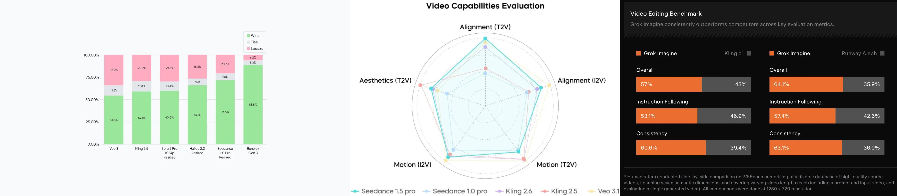
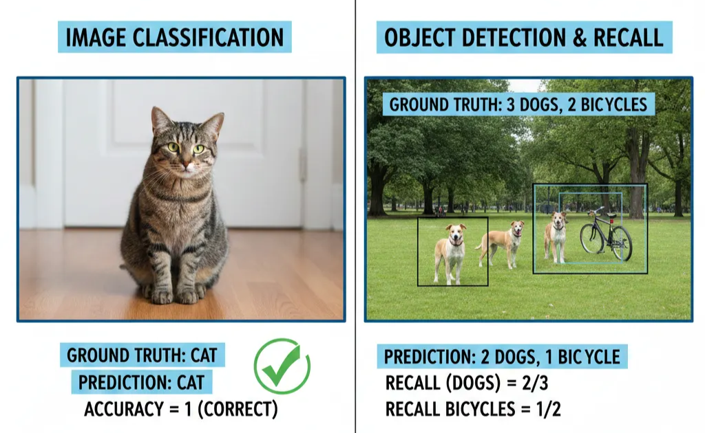
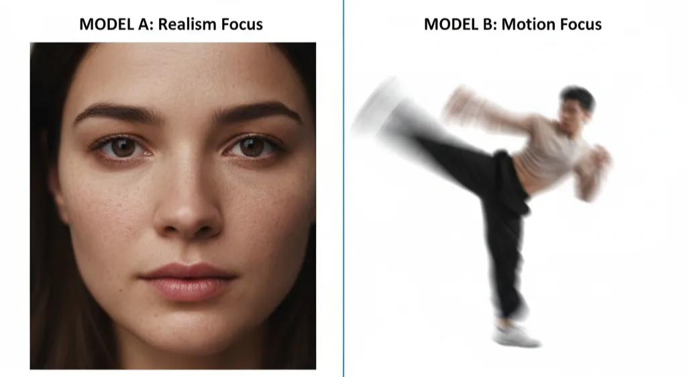

# 目录

* **[GSB 评测方法概述](#gsb评测方法概述)**
    * [基本原理](#基本原理)
    * [为什么视频生成评测需要 GSB](#为什么视频生成评测需要gsb)
* **[GSB 评测的关键点](#gsb评测关键点)**
    * [评测集的构造](#评测集的构造)
    * [如何定义科学的分布：从平均主义到业务对齐](#如何定义科学的分布从平均主义到业务对齐)
    * [维度解耦](#维度解耦)
* **[局限性](#局限性)**
    * [高昂的综合成本](#高昂的综合成本)
    * [“全量微优”引发的数值爆炸](#全量微优引发的数值爆炸)
    * [大数值不显著](#大数值不显著)

# GSB评测方法概述

在视频生成领域，像 Google 的 [Veo3](https://deepmind.google/models/veo/)，字节跳动 的 [Seedance](https://seed.bytedance.com/zh/seedance1_5_pro)，或是 xAI 最近发布的 [Grok Imagine](https://x.ai/news/grok-4)  等模型的发布， GSB(Good/Same/Bad) 指标通常是Release note中不可或缺的一部分，成为佐证模型能力（打压竞争对手模型）最直观的证据。

## 基本原理

GSB的原理很简单，标注人员将模型 A（实验模型） 与模型 B（对比模型）在相同输入条件下生成的视频进行两两对比，会产生以下三种标注结果：

- **Good**: 模型 A 优于 B。
- **Same**: 两个模型都很好（旗鼓相当）/都一般（互有胜负）/都很差（菜鸡互啄）。
- **Bad**: 模型 A 差于 B。

在进行多次测试后，统计出的三种情况的票型，最终：

$$
GSB = \frac{G+S}{B+S}
$$

## 为什么视频生成评测需要GSB

在传统的计算机视觉（CV）任务中，准确率（Accuracy）和召回率（Recall）的计算依赖于标准答案（Ground Truth）。例如在图像分类任务中，一张图是猫还是狗，它的答案是唯一的；

LLM语言模型虽然生成具有多样性，其主流 Benchmark（如 MMLU、GSM8K）依然倾向于通过 QA（问答）对的形式，将复杂的文本生成转化为类似高考的选择填空题，从而生成“唯一正解”。因此准确率成为了LLM或多模态理解模型榜单的核心指标：

视频生成模型则完全不同，当用户输入“一只狗在草地上奔跑”时，并不存在所谓的“标准答案”。光影的变化、狗的品种、奔跑的姿态都有无数种可能。评测过程中更倾向于“只要不错就是对”。在视频生成相关 Benchmark 中，视频模型往往只有 $Q$（Prompt）而没有 $A$（Target Video）。

既然没有标准答案，退而求其次地采用“绝对打分制”是否可行呢。在实际工程实践中，打分制存在以下致命缺陷：

1. **尺度难以定义**：在分数档位的定义中，1分和5分的边界标准是十分容易定义的，但中间却是相对模糊的。例如在某一个维度（例如动态质量）很难为 3.0 分与 3.5 分设定清晰的分界点。当评价体系缺乏离散且具象的锚点时，标注人员往往只能依靠体感进行模糊量化。这种缺乏颗粒度支撑的分值，不仅难以复现，更无法在模型调优阶段提供精准的反馈。
2. **尺度难以对齐**：正如“一千个人眼中有一千个哈姆雷特”，进一步上升到美学偏好时，对于相同的结果，每个人的评价都是主观且多样的。标注人员 A 眼中的“8 分”可能是评测员 B 眼中的“6 分”。即使经过培训，也很难在长期的评测中保持一致的评价尺度。
3. **尺度动态变化**：随着模型能力的迭代，上一个月的“优秀结果”在这个月可能只能及格。绝对分值会随着模型天花板的提升而不断漂移，这种绝对分值的“通货膨胀”**导致历史数据迅速失去纵向对比的价值**。
4. **理想与现实的gap**：即便定义出远超当前模型能力的“理想化标准”，会导致现阶段所有实验结果都堆积在低分段。这种“分数坍塌”现象使得微小的算法优化被掩盖在统计噪声中，让算法团队陷入“做了改进却看不见提升”的迷茫。

# GSB评测的关键点

## 评测集的构造

由于GSB评测是一项统计分布性质的测试，因此一轮测试中不同类别下的case分布能够直接影响GSB的分值，例如有以下两种模型：

- **模型A**：擅长写实类人像的视频生成，皮肤纹理细腻、毛孔清晰，视觉冲击力极强；但代价是牺牲了时间维度的连贯性，表现为表情呆滞、肢体动作幅度微小。
- **模型B**：擅长处理舞蹈、武术等高难度、大幅度的动作展现；但在细节表现上略显粗糙，高频运动下偶尔伴随画面模糊或肢体幻觉。
    
    
    

如果缺乏科学的分布，那么两个有偏的评测集将会出现截然相反的结果，GSB 分值就会毫无意义。

## 如何定义科学的分布：从平均主义到业务对齐

既然 Case 分布能左右胜负，那么将所有类别平均分配就是科学的吗？答案是否定的，在业务迭代中，科学的分布等于业务权重的投影，应根据产品的核心受众、战略重心等多个方面进行加权配比。例如一家公司想要推出一款名为“漫剧创作大师”的产品，那么动漫场景的 Case 比例可能需要占到 80% 以上。即便模型在写实人像（如上述模型 A）上表现再好，如果它在动漫垂直领域的 GSB 低于基准，这次模型迭代依然是不及预期的。

再例如针对上述产品，它的目标用户群体上至专业创作者，下至普通小白用户。那么从 prompt 复杂度便需要兼顾详细而结构化清晰的文本以及简短描述。

评测集同时必须具备明确的难度阶梯，这样才能够摸到模型的上限和下限。

在实际的评测集构造过程中，所需设计的细节往往是多样且复杂的，因此需要频繁与关注技术边界的算法工程师和关注用户痛点的产品经理进行沟通。

## 维度解耦

回到 评测集构造 节的例子，在面对模型A 与模型B 这种“偏科生”时，单一的 GSB 分数往往难以衡量各个模型的优势和劣势。将评测拆解为相互正交的独立维度，再基于一定的权重拟合为整体，这种将维度解耦是会使得最终指标结果可解释性更强。在视频生成领域，包括但不限于以下几种维度：

| 维度 | 基本定义 |
| --- | --- |
| 动态质量(Motion Quality) | 侧重关注时序逻辑，关注动作的流畅度、物理规律的遵循（如重力、碰撞）等能力。 |
| 画面质量 (Visual Quality) | 侧重静态美学，关注清晰度、色彩、构图及物体表面的纹理细节等能力。 |
| 文字相关性 (Text Alignment) | 侧重语义理解，关注模型是否准确还原了 Prompt 中的主体动作、空间关系、指令等遵循能力。 |
| 主体一致性 (Subject Consistency) | 侧重参考一致性，关注人物面部、服装纹理、商品细节的还原能力。 |

通过维度解耦，模型之间的对比不再是单纯的数字大小，而是一张能力画像的雷达图。

# 局限性

## 高昂的综合成本

- 规则制定：为了减少歧义，标注规则（如前文提到的每一个维度的标准）需要反复推敲，甚至需要经过多轮预标注来对齐不同人员的认知。
- 评测集构造：评测集是动态迭代的，需要与算法和产品经理进行深度的协同，这个过程往往会持续数周数月甚至以年为单位。
- 标注过程：与文本/图片评测相比，当前视频评测的还处于比较原始的人工标注阶段。标注员需要反复回看两段视频的动态细节、色彩及连贯性。对于大规模评测（例如 500+ 条 case），标注周期往往成为研发敏捷性的瓶颈。

## “全量微优”引发的数值爆炸

GSB 公式存在一个潜在数学缺陷，举一个极端的例子：假设在 500 条 case 中，模型 A 仅仅比模型 B 在某一个问题上“好了一点点”，但其他维度均相同。在对比过程中每一条case都被标注为 good，得到数值会趋向于无穷大。这种1%的优势带来的数值爆炸会给人一种模型A 彻底碾压模型B 的错觉，但实际上模型 A 可能只是在某些边缘特征上实现了面广但程度极浅的优化。维度解耦可以缓解这个问题，但并未根治。

## 大数值不显著

在评测过程中，往往会遇到明明 GSB 指标是一个很大的值，但统计结论却是“不显著”。这通常由样本量过低或结果方差过大导致。后者往往是 good 和 bad 均有比较大的两级，而 same 比较少，整体呈现波动状态较大。这里也引入下一篇文章要阐述的：显著性检验（Significance Testing）。